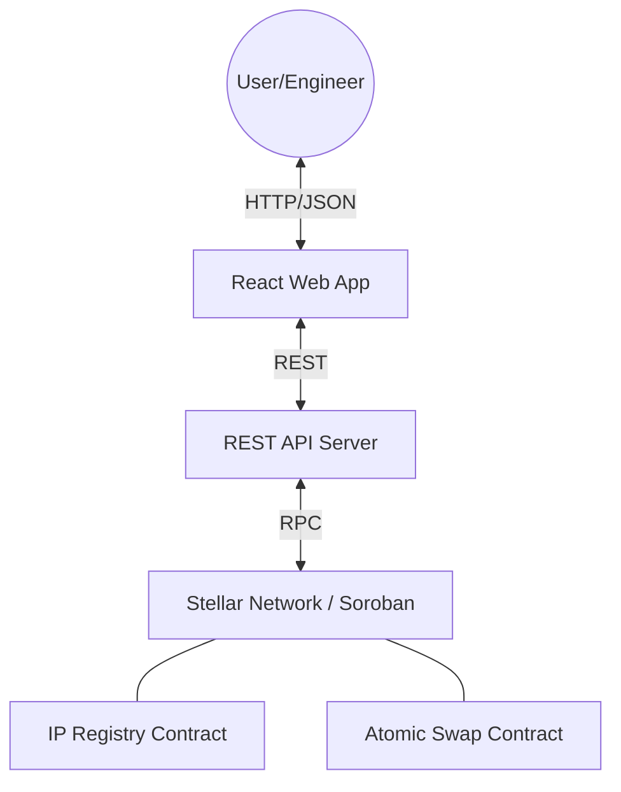
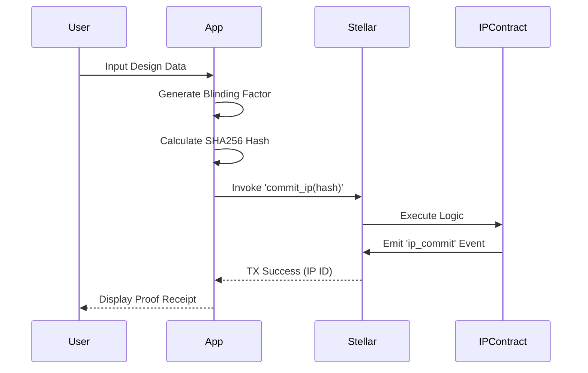
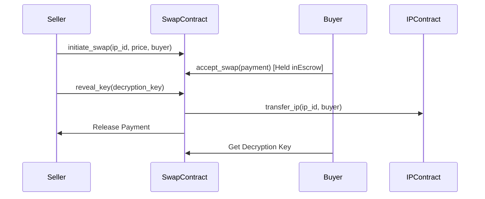

# System Architecture

Atomic Patent is a decentralized IP registry and marketplace built on the Stellar network using Soroban smart contracts.

## 🏗️ High-Level Component Diagram

## 🔒 Security Architecture: Pedersen Commitments

Atomic Patent uses **Pedersen Commitments** to allow users to timestamp ideas without revealing the content.

1. **Preimage:** `Secret Design Data || Blinding Factor (32 bytes)`
2. **Commitment:** `SHA256(Preimage)`
3. **Registry:** Only the `Commitment` and `Owner Address` are stored on-chain.

Proof of prior art is established by revealing the `Secret` and `Blinding Factor` later. The contract verifies that the hash matches the on-chain record.

## 🔄 Core Flows

### 1. IP Commitment Flow

### 2. Atomic Swap Flow (Patent Sale)

## 💾 Storage Model

### IP Registry Contract
- **NextId:** Monotonic counter for unique IP IDs.
- **IpRecord (u64):** Stores mapping of IP ID to metadata (owner, hash, timestamp, revocation status).
- **OwnerIps (Address):** Maps owner address to a vector of their IP IDs for efficient listing.
- **CommitmentOwner (BytesN<32>):** Reverse mapping to prevent duplicate registrations of the same hash.

### Atomic Swap Contract
- **SwapRecord (u64):** Stores details of an active/completed swap (seller, buyer, price, status, escrowed token).

## 🌍 Infrastructure

- **Network:** Stellar Testnet & Mainnet.
- **RPC:** Public Soroban RPC nodes (SDF).
- **Automation:** GitHub Actions for contract deployment and API testing.
- **Monitoring:** Periodic health checks and ledger event indexing (planned).
