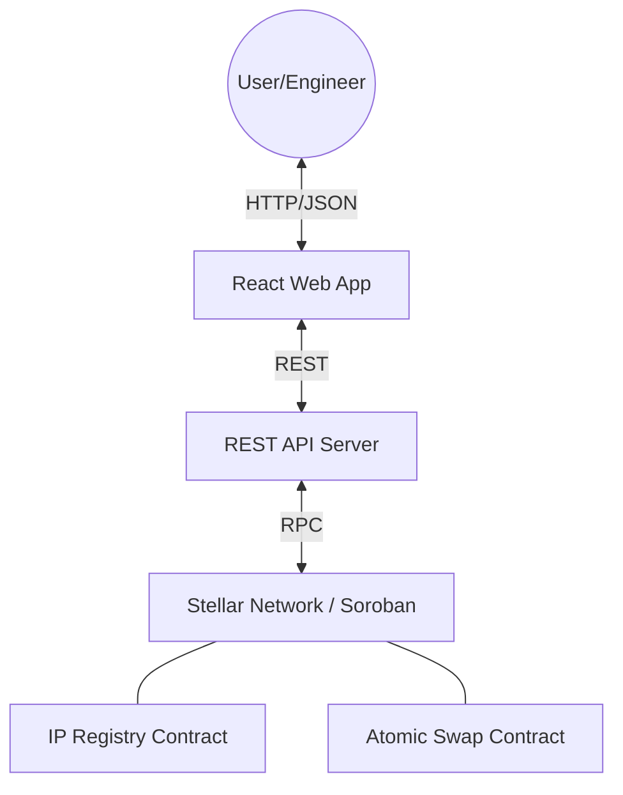
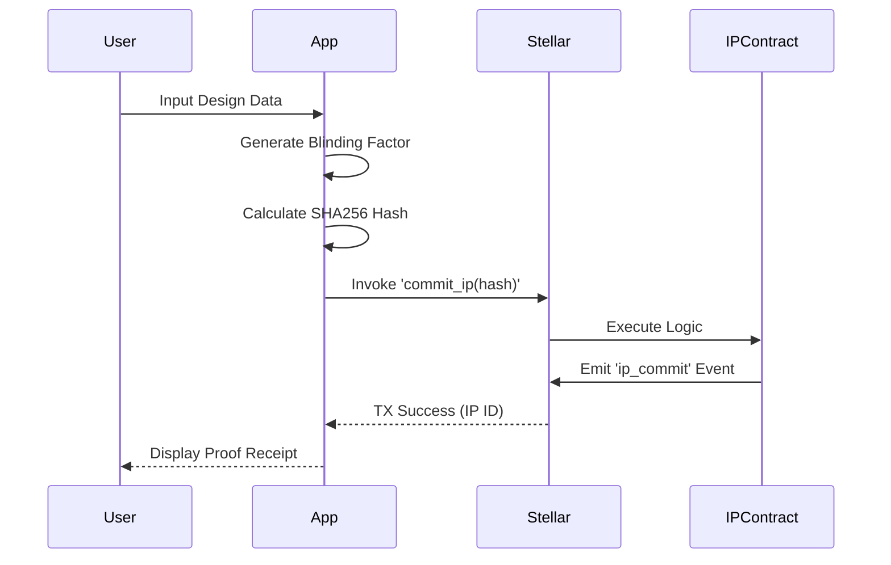
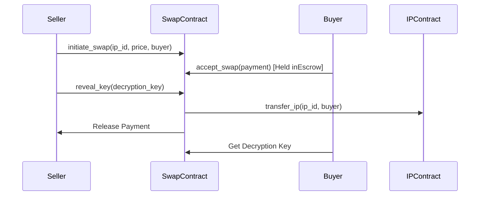
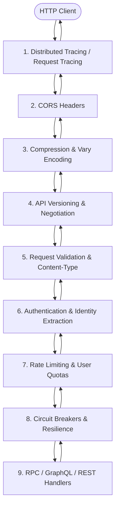

# System Architecture

Atomic Patent is a decentralized IP registry and marketplace built on the Stellar network using Soroban smart contracts.

## 🏗️ High-Level Component Diagram


```mermaid
graph TD
    User((User/Engineer))
    Frontend[React Web App]
    API[REST API Server]
    Stellar[Stellar Network / Soroban]
    IPContract[IP Registry Contract]
    SwapContract[Atomic Swap Contract]

    User <-->|HTTP/JSON| Frontend
    Frontend <-->|REST| API
    API <-->|RPC| Stellar
    Stellar --- IPContract
    Stellar --- SwapContract
```

## 🔒 Security Architecture: Pedersen Commitments

Atomic Patent uses **Pedersen Commitments** to allow users to timestamp ideas without revealing the content.

1. **Preimage:** `Secret Design Data || Blinding Factor (32 bytes)`
2. **Commitment:** `SHA256(Preimage)`
3. **Registry:** Only the `Commitment` and `Owner Address` are stored on-chain.

Proof of prior art is established by revealing the `Secret` and `Blinding Factor` later. The contract verifies that the hash matches the on-chain record.

## 🔄 Core Flows

### 1. IP Commitment Flow


```mermaid
sequenceDiagram
    participant User
    participant App
    participant Stellar
    participant IPContract

    User->>App: Input Design Data
    App->>App: Generate Blinding Factor
    App->>App: Calculate SHA256 Hash
    App->>Stellar: Invoke 'commit_ip(hash)'
    Stellar->>IPContract: Execute Logic
    IPContract->>Stellar: Emit 'ip_commit' Event
    Stellar-->>App: TX Success (IP ID)
    App-->>User: Display Proof Receipt
```

### 2. Atomic Swap Flow (Patent Sale)


```mermaid
sequenceDiagram
    participant Seller
    participant SwapContract
    participant Buyer
    participant IPContract

    Seller->>SwapContract: initiate_swap(ip_id, price, buyer)
    Buyer->>SwapContract: accept_swap(payment) [Held inEscrow]
    Seller->>SwapContract: reveal_key(decryption_key)
    SwapContract->>IPContract: transfer_ip(ip_id, buyer)
    SwapContract->>Seller: Release Payment
    Buyer->>SwapContract: Get Decryption Key
```

## 💾 Storage Model

### IP Registry Contract
- **NextId:** Monotonic counter for unique IP IDs.
- **IpRecord (u64):** Stores mapping of IP ID to metadata (owner, hash, timestamp, revocation status).
- **OwnerIps (Address):** Maps owner address to a vector of their IP IDs for efficient listing.
- **CommitmentOwner (BytesN<32>):** Reverse mapping to prevent duplicate registrations of the same hash.

#### Commitment Sharding
Every commitment is assigned to one of `NUM_SHARDS` (16) buckets, keyed by the first byte of its
commitment hash, so that indexing work is distributed instead of funneling through a single
storage entry.

Within a shard, IDs are stored across bounded **sub-shards** (`ShardSubIps(shard_id, sub_index)`,
capped at `SUB_SHARD_CAPACITY` = 512 entries each) rather than one ever-growing vector. A
`ShardHead(shard_id)` pointer tracks the sub-shard currently being appended to; once it fills, a
new sub-shard is opened. This bounds the read/write cost of every commitment to a fixed amount of
storage, regardless of how many commitments a shard has accumulated over the contract's lifetime.

Shards written before this bounded layout existed keep their entries under the legacy
`ShardIps(shard_id)` key. Rather than a one-shot admin migration, each write into such a shard
migrates a bounded batch of legacy entries into the sub-shard layout first, so a large backlog
drains gradually across ordinary traffic instead of one oversized transaction.

Reads use `list_ip_by_shard(shard_id, cursor)`, which returns one bounded page (at most
`SUB_SHARD_CAPACITY` IDs) plus a cursor for the next page. Full enumeration means following that
cursor across separate calls — a single call intentionally cannot return an entire shard's
contents, since that could itself grow without bound.

### Atomic Swap Contract
- **SwapRecord (u64):** Stores details of an active/completed swap (seller, buyer, price, status, escrowed token).

## 🌍 Infrastructure

- **Network:** Stellar Testnet & Mainnet.
- **RPC:** Public Soroban RPC nodes (SDF).
- **Automation:** GitHub Actions for contract deployment and API testing.
- **Monitoring:** Periodic health checks and ledger event indexing (planned).

## 🛡️ API Server Middleware Pipeline & Ordering

The API Server uses an onion-layered middleware pipeline built on Axum/Tower. Incoming HTTP requests traverse from the outermost edge layer inward to the route handler, and outgoing HTTP responses traverse back out in reverse order.


```mermaid
graph TD
    Client([HTTP Client]) --> M1[1. Distributed Tracing / Request Tracing]
    M1 --> M2[2. CORS Headers]
    M2 --> M3[3. Compression & Vary Encoding]
    M3 --> M4[4. API Versioning & Negotiation]
    M4 --> M5[5. Request Validation & Content-Type]
    M5 --> M6[6. Authentication & Identity Extraction]
    M6 --> M7[7. Rate Limiting & User Quotas]
    M7 --> M8[8. Circuit Breakers & Resilience]
    M8 --> Handler[9. RPC / GraphQL / REST Handlers]

    Handler --> M8
    M8 --> M7
    M7 --> M6
    M6 --> M5
    M5 --> M4
    M4 --> M3
    M3 --> M2
    M2 --> M1
    M1 --> Client
```

### Pipeline Layer Specification

| Inbound Order | Outbound Order | Middleware Layer | Module | Primary Responsibility |
|:---:|:---:|:---|:---|:---|
| **1** | **8** | **Tracing & Metrics** | `tracing_middleware.rs` / `distributed_tracing.rs` | Extracts/generates `X-Trace-ID` and `X-Request-ID`, creates root request span, starts request timing, and attaches trace headers to *all* responses (including early rejections). |
| **2** | **7** | **CORS** | `middleware_pipeline.rs:cors_middleware` | Injects CORS headers (`Access-Control-Allow-Origin`, `Access-Control-Allow-Headers`, etc.) across all responses (200, 400, 401, 429, 500). |
| **3** | **6** | **Compression** | `compression.rs:compression_middleware` | Inspects `Accept-Encoding`, appends `Vary: Accept-Encoding`, and applies gzip/brotli/deflate encoding to outgoing payloads. |
| **4** | **5** | **API Versioning** | `versioning.rs:version_negotiation` | Evaluates `Accept-Version` header / version URL prefix, rejects unsupported versions with `406 Not Acceptable`, and sets `API-Version`. |
| **5** | **4** | **Request Validation** | `validation_middleware.rs` / `require_json_content_type` | Validates `Content-Type: application/json` on mutating requests (POST/PUT/PATCH) and checks payload schemas before expensive operations. |
| **6** | **3** | **Authentication** | `auth.rs:require_auth` | Verifies JWT bearer tokens or Stellar Ed25519 signatures; extracts `Claims` and inserts `AuthExtension` into request extensions. Rejects unauthenticated requests with `401 Unauthorized`. |
| **7** | **2** | **Rate Limiting** | `rate_limit.rs:rate_limit_middleware` | Token-bucket enforcement across global, source-IP, and authenticated user scopes. Employs `AuthExtension` to apply user tiers (Free/Premium/Enterprise). |
| **8** | **1** | **Circuit Breaker** | `circuit_breaker.rs` | Protects downstream dependencies (Soroban RPC node, database, Redis) against cascading outages with fast-failure when tripped. |
| **9** | — | **Handlers** | `handlers.rs`, `graphql.rs`, `batch.rs` | Executes business logic, interacts with smart contracts via Soroban RPC client, and returns JSON/GraphQL responses. |

### ⚠️ Ordering Rationale & Anti-Pattern Flags

The exact sequence of middleware execution is critical to system security, performance, and correctness:

1. **Authentication BEFORE Rate Limiting (Crucial Rule)**:
   - **Why Auth must precede Rate Limiting**: Placing authentication *before* rate limiting ensures the caller's verified identity (`AuthExtension`) is available during rate-limit evaluation. This allows the rate limiter to correctly apply user billing tiers (e.g. Premium vs. Enterprise vs. Free) and enforce user-level quotas rather than falling back to IP-based rate limiting.
   - **Flagged Anti-Pattern (Rate Limiting before Auth)**: Placing rate limiting *before* authentication is dangerous because unauthenticated traffic can exhaust the global and IP rate-limit budgets for legitimate authenticated clients sharing a proxy or NAT gateway. Furthermore, unauthenticated requests could consume quotas before identity verification occurs.
2. **Tracing & CORS Outermost**:
   - Tracing must wrap all other layers so that rejection responses generated by upstream middleware (e.g., 401 Unauthorized from auth, 429 from rate limit, 415 from content validation) still receive trace identifiers, metrics tracking, and accurate duration measurements.
   - CORS must be placed outside auth and rate limiting so that browser clients making cross-origin requests receive valid CORS headers on error responses (`401`, `429`, `500`) and preflight `OPTIONS` requests succeed without requiring authentication.
3. **Request Validation before Authentication/Rate Limiting**:
   - Rejecting requests lacking required headers (e.g., non-JSON bodies on mutating endpoints) early prevents unnecessary cryptographic signature verification and token bucket consumption.

### Middleware Pipeline Implementation Notes

The API Server middleware pipeline is implemented in `api-server/src/middleware_pipeline.rs` using Axum/Tower's layered middleware system. Requests flow through layers from outside-in on ingress and inside-out on egress.

#### Key Implementation Details

- **Layer Configuration**: `DOCUMENTED_PIPELINE_ORDER` constant in `middleware_pipeline.rs` defines the official order.
- **Runtime Validation**: `validate_pipeline_ordering()` function checks for common ordering anti-patterns at startup.
- **Layer Assembly**: Layers must be added in **reverse** order in code (innermost added first) because Tower stacks them outward.
- **Axum Router Construction**: In `main.rs`, layers are applied using `.layer(middleware::from_fn(...))` in the correct sequence.

#### Module References

| Module | Responsibility | File |
|--------|---|---|
| Distributed Tracing | Trace ID generation, request timing | `distributed_tracing.rs`, `tracing_middleware.rs` |
| CORS | Cross-origin request headers | `middleware_pipeline.rs` |
| Compression | Request/response encoding (gzip, brotli, deflate) | `compression.rs` |
| API Versioning | Version negotiation via headers/URL | `versioning.rs` |
| Validation | Content-Type, payload schema checks | `validation_middleware.rs`, `validation.rs` |
| Authentication | JWT/Ed25519 signature verification | `auth.rs` |
| Rate Limiting | Token-bucket quotas per user/IP/global | `rate_limit.rs` |
| Circuit Breaker | Failure resilience for RPC/Redis/DB | `circuit_breaker.rs` |
| Handler Execution | Business logic, Soroban RPC calls | `handlers.rs`, `graphql.rs`, `batch.rs` |

#### Testing the Pipeline

The middleware pipeline is tested in `middleware_pipeline.rs` tests:

1. **`test_documented_pipeline_order_matches_architecture()`**: Verifies the documented order is internally consistent and passes validation rules.
2. **`test_pipeline_runtime_execution_order_in_axum()`**: Constructs a real Axum app with all middleware layers and verifies inbound/outbound execution order using a shared log.
3. **Anti-Pattern Detection Tests**: Each test flags a specific unintended ordering (e.g., RateLimit before Auth, Auth before CORS) and asserts it is rejected by `validate_pipeline_ordering()`.

To run tests:
```bash
cd api-server
cargo test middleware_pipeline
```

