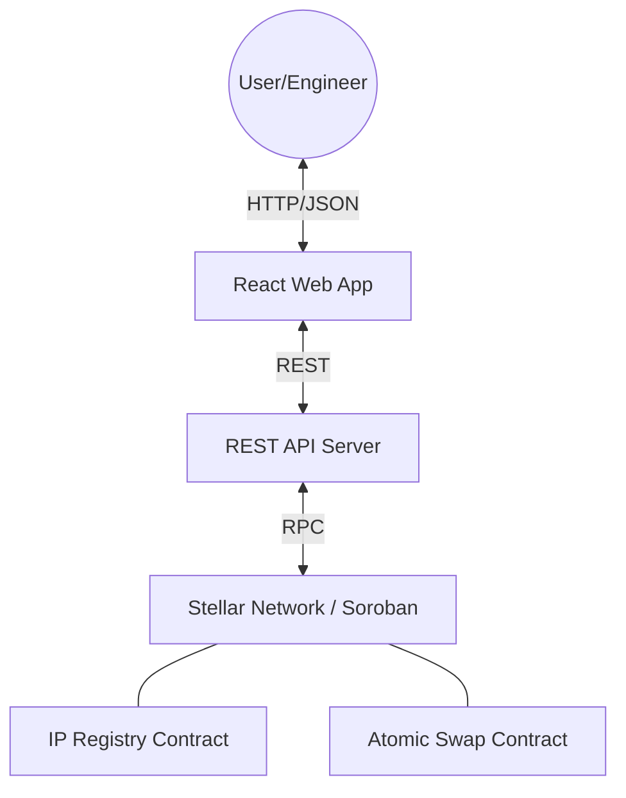
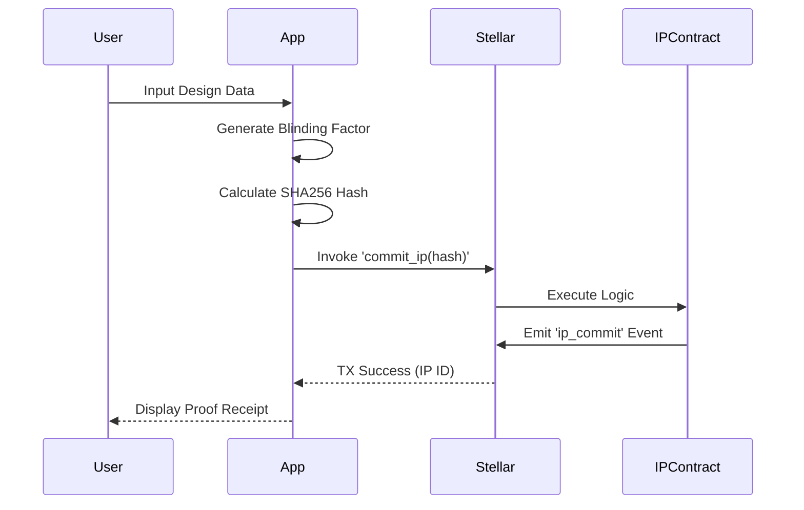
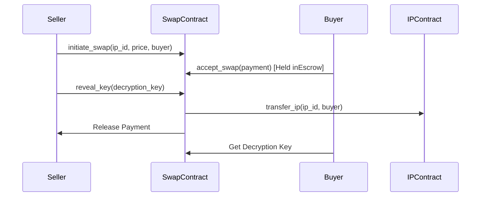

# System Architecture

Atomic Patent is a decentralized IP registry and marketplace built on the Stellar network using Soroban smart contracts.

## 🏗️ High-Level Component Diagram


```mermaid
graph TD
    User((User/Engineer))
    Frontend[React Web App]
    API[REST API Server]
    Stellar[Stellar Network / Soroban]
    IPContract[IP Registry Contract]
    SwapContract[Atomic Swap Contract]

    User <-->|HTTP/JSON| Frontend
    Frontend <-->|REST| API
    API <-->|RPC| Stellar
    Stellar --- IPContract
    Stellar --- SwapContract
```

## 🔒 Security Architecture: Pedersen Commitments

Atomic Patent uses **Pedersen Commitments** to allow users to timestamp ideas without revealing the content.

1. **Preimage:** `Secret Design Data || Blinding Factor (32 bytes)`
2. **Commitment:** `SHA256(Preimage)`
3. **Registry:** Only the `Commitment` and `Owner Address` are stored on-chain.

Proof of prior art is established by revealing the `Secret` and `Blinding Factor` later. The contract verifies that the hash matches the on-chain record.

## 🔄 Core Flows

### 1. IP Commitment Flow


```mermaid
sequenceDiagram
    participant User
    participant App
    participant Stellar
    participant IPContract

    User->>App: Input Design Data
    App->>App: Generate Blinding Factor
    App->>App: Calculate SHA256 Hash
    App->>Stellar: Invoke 'commit_ip(hash)'
    Stellar->>IPContract: Execute Logic
    IPContract->>Stellar: Emit 'ip_commit' Event
    Stellar-->>App: TX Success (IP ID)
    App-->>User: Display Proof Receipt
```

### 2. Atomic Swap Flow (Patent Sale)


```mermaid
sequenceDiagram
    participant Seller
    participant SwapContract
    participant Buyer
    participant IPContract

    Seller->>SwapContract: initiate_swap(ip_id, price, buyer)
    Buyer->>SwapContract: accept_swap(payment) [Held inEscrow]
    Seller->>SwapContract: reveal_key(decryption_key)
    SwapContract->>IPContract: transfer_ip(ip_id, buyer)
    SwapContract->>Seller: Release Payment
    Buyer->>SwapContract: Get Decryption Key
```

## 💾 Storage Model

### IP Registry Contract
- **NextId:** Monotonic counter for unique IP IDs.
- **IpRecord (u64):** Stores mapping of IP ID to metadata (owner, hash, timestamp, revocation status).
- **OwnerIps (Address):** Maps owner address to a vector of their IP IDs for efficient listing.
- **CommitmentOwner (BytesN<32>):** Reverse mapping to prevent duplicate registrations of the same hash.

### Atomic Swap Contract
- **SwapRecord (u64):** Stores details of an active/completed swap (seller, buyer, price, status, escrowed token).

## 🗄️ Caching Architecture (#629)

The API server implements a multi-layer caching strategy for performance optimization.

### Cache Layers

| Layer | Technology | Purpose | TTL |
|---|---|---|---|
| L1 (In-Memory) | DashMap + LRU | Hot IP/Swap data | 30-60s |
| L2 (Distributed) | Redis (optional) | Shared cache across instances | Configurable |
| L3 (CDN) | Cache-Control headers | Browser/reverse-proxy caching | Public max-age |

### LRU Eviction Policy (#629)

When the in-memory cache exceeds 10,000 entries, the **least recently used** entries are evicted first. This ensures the cache retains the most frequently accessed data while bounding memory usage.

- **Max Entries**: 10,000
- **Eviction Strategy**: LRU (Least Recently Used)
- **Access Tracking**: Every `get()` and `set()` operation promotes the key to MRU (Most Recently Used) position
- **Eviction Counters**: Tracked via `LRU_EVICTIONS` metric

### TTL-Based Eviction

TTLs are tailored to data volatility:

| Data Type | Default TTL | Rationale |
|---|---|---|
| IP Records | 60s | Relatively stable — changes only on transfer/revocation |
| Swap Records | 30s | State changes frequent during active swaps |
| Reputation Scores | 300s (5 min) | Slow-changing — updated after completed swaps |
| Commitments (#629) | 3600s (1h) | Commitments are immutable once written |
| Prices (#629) | 900s (15min) | Price data changes periodically |

### Redis Integration (#629)

When `REDIS_URL` environment variable is set, the cache layer attempts to use Redis for distributed caching:

```rust
// Cache degrades gracefully when Redis is unavailable
static REDIS_CLIENT: Lazy<Option<String>> = Lazy::new(|| {
    std::env::var("REDIS_URL").ok()
});
```

- **Graceful Degradation**: Falls back to in-memory DashMap cache when Redis is unreachable
- **Configuration**: Set `REDIS_URL` environment variable
- **Use Case**: Multi-instance deployments where cache coherence across instances is required

### Cache Invalidation

Cache entries are invalidated on the following events:

| Event | Invalidated Keys |
|---|---|
| IP Transferred | Individual IP + IP list prefix |
| IP Revoked | Individual IP + IP list prefix |
| Swap Started | Swap + seller/buyer lists |
| Swap Accepted | Swap + seller/buyer lists |
| Swap Completed | Swap + seller/buyer lists + reputation |
| Swap Cancelled | Swap + seller/buyer lists |
| Data Deletion (GDPR) | All user IP lists, swap lists, reputation |
| Unknown Event | All swap and IP prefixes (broad) |

### Cache Prewarming (#629)

Hot data keys can be registered for automatic cache prewarming at startup:

```rust
// Register a key to be prewarmed on server start
cache::register_prewarm_key("ip:popular:1");
```

### Cache Statistics

Extended statistics are available:

| Metric | Description |
|---|---|
| `total_entries` | Current number of cached entries |
| `hits` | Total cache hits since startup |
| `misses` | Total cache misses since startup |
| `hit_rate` | Hit rate as a ratio (0.0 - 1.0) |
| `lru_evictions` | Number of LRU evictions performed |
| `ttl_evictions` | Number of TTL expiry evictions |
| `memory_estimate_bytes` | Estimated memory usage |

## 🌍 Infrastructure

- **Network:** Stellar Testnet & Mainnet.
- **RPC:** Public Soroban RPC nodes (SDF).
- **Automation:** GitHub Actions for contract deployment and API testing.
- **Monitoring:** Periodic health checks and ledger event indexing (planned).
