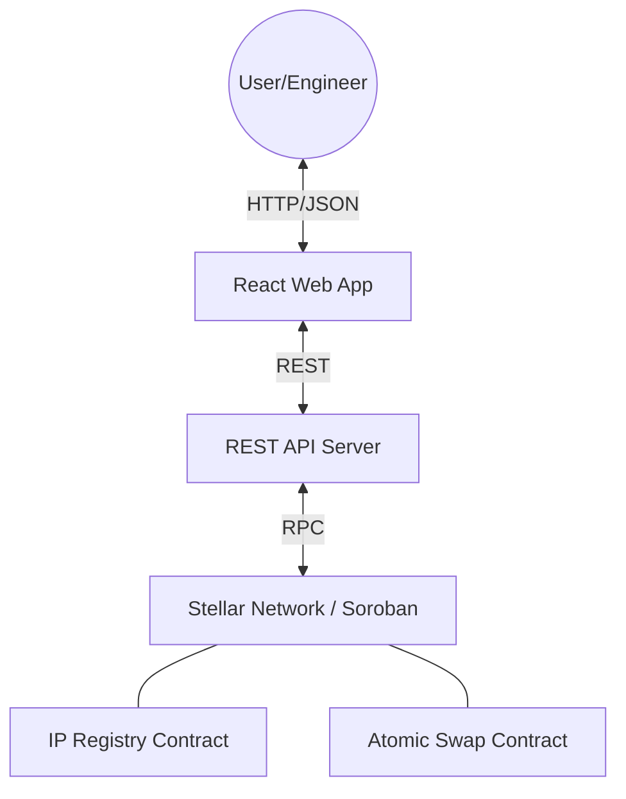
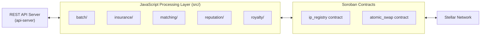
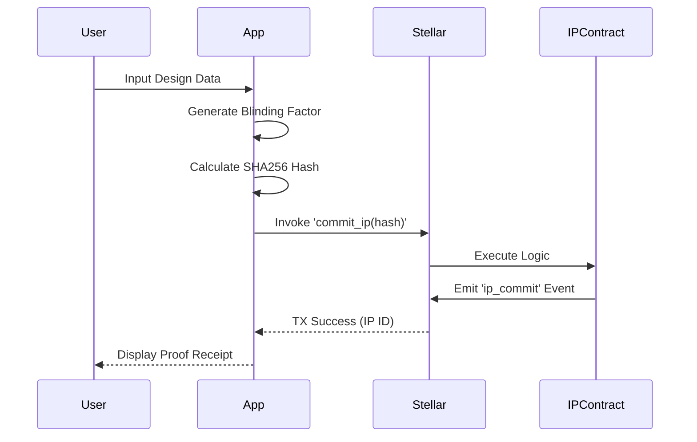
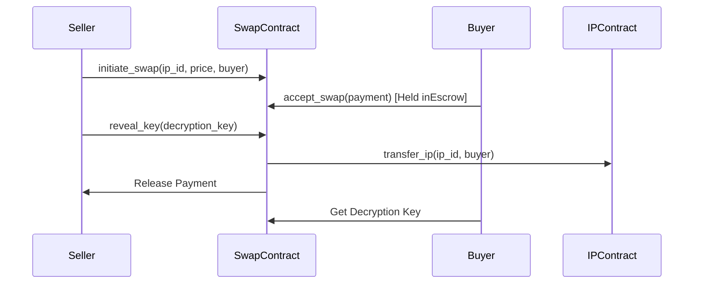

# System Architecture

Atomic Patent is a decentralized IP registry and marketplace built on the Stellar network using Soroban smart contracts.

## 🏗️ High-Level Component Diagram


```mermaid
graph TD
    User((User/Engineer))
    Frontend[React Web App]
    API[REST API Server]
    Stellar[Stellar Network / Soroban]
    IPContract[IP Registry Contract]
    SwapContract[Atomic Swap Contract]

    User <-->|HTTP/JSON| Frontend
    Frontend <-->|REST| API
    API <-->|RPC| Stellar
    Stellar --- IPContract
    Stellar --- SwapContract
```

## 🔗 JavaScript Processing Layer

The `src/` directory contains Node.js batch processing, matching, reputation, insurance, and royalty modules that complement the on-chain contracts. These modules run off-chain and integrate with the REST API server.

### JS Module Architecture


```mermaid
graph LR
    APIServer["REST API Server<br/>(api-server)"]
    
    subgraph JsLayer["JavaScript Processing Layer (src/)"]
        Batch["batch/"]
        Insurance["insurance/"]
        Matching["matching/"]
        Reputation["reputation/"]
        Royalty["royalty/"]
    end
    
    subgraph Contracts["Soroban Contracts"]
        IPReg["ip_registry contract"]
        Swap["atomic_swap contract"]
    end
    
    APIServer <--> JsLayer
    JsLayer <--> Contracts
    Contracts <--> Stellar["Stellar Network"]
```

### Module Responsibilities

| Module | Purpose |
|---|---|
| **batch/** | Processes batch IP commitments and transfers in scheduled operations |
| **insurance/** | Manages IP indemnity and coverage calculations |
| **matching/** | Matches buyers and sellers; orchestrates market-making logic |
| **reputation/** | Scores and tracks user reputation for trust-based operations |
| **royalty/** | Calculates and distributes secondary sale royalties |

### Integration Flow

1. **Client Request** → REST API Server
2. **API Server** → Delegates to appropriate JS module (`batch`, `matching`, `reputation`, etc.)
3. **JS Module** → Reads/writes contract state via RPC calls to `ip_registry` or `atomic_swap`
4. **Contracts** → Execute on-chain logic and emit events
5. **Response** → Results flow back through API Server to client

### Key Integration Points

- **IP Registry Contract** — All modules read IP ownership and commitment status via `get_ip()` and `list_ip_by_owner()`
- **Atomic Swap Contract** — `matching` and `batch` modules orchestrate swaps via `initiate_swap()`, `accept_swap()`, `reveal_key()`
- **Reputation System** — Built on historical swap outcomes; written to off-chain database, queried by `matching` for buyer/seller scoring
- **Royalty Distribution** — Triggered on successful swaps; calculated based on original creator and sale price

## 🔒 Security Architecture: Pedersen Commitments

Atomic Patent uses **Pedersen Commitments** to allow users to timestamp ideas without revealing the content.

1. **Preimage:** `Secret Design Data || Blinding Factor (32 bytes)`
2. **Commitment:** `SHA256(Preimage)`
3. **Registry:** Only the `Commitment` and `Owner Address` are stored on-chain.

Proof of prior art is established by revealing the `Secret` and `Blinding Factor` later. The contract verifies that the hash matches the on-chain record.

## 🔄 Core Flows

### 1. IP Commitment Flow


```mermaid
sequenceDiagram
    participant User
    participant App
    participant Stellar
    participant IPContract

    User->>App: Input Design Data
    App->>App: Generate Blinding Factor
    App->>App: Calculate SHA256 Hash
    App->>Stellar: Invoke 'commit_ip(hash)'
    Stellar->>IPContract: Execute Logic
    IPContract->>Stellar: Emit 'ip_commit' Event
    Stellar-->>App: TX Success (IP ID)
    App-->>User: Display Proof Receipt
```

### 2. Atomic Swap Flow (Patent Sale)


```mermaid
sequenceDiagram
    participant Seller
    participant SwapContract
    participant Buyer
    participant IPContract

    Seller->>SwapContract: initiate_swap(ip_id, price, buyer)
    Buyer->>SwapContract: accept_swap(payment) [Held inEscrow]
    Seller->>SwapContract: reveal_key(decryption_key)
    SwapContract->>IPContract: transfer_ip(ip_id, buyer)
    SwapContract->>Seller: Release Payment
    Buyer->>SwapContract: Get Decryption Key
```

## 💾 Storage Model

### IP Registry Contract
- **NextId:** Monotonic counter for unique IP IDs.
- **IpRecord (u64):** Stores mapping of IP ID to metadata (owner, hash, timestamp, revocation status).
- **OwnerIps (Address):** Maps owner address to a vector of their IP IDs for efficient listing.
- **CommitmentOwner (BytesN<32>):** Reverse mapping to prevent duplicate registrations of the same hash.

#### Commitment Sharding
Every commitment is assigned to one of `NUM_SHARDS` (16) buckets, keyed by the first byte of its
commitment hash, so that indexing work is distributed instead of funneling through a single
storage entry.

Within a shard, IDs are stored across bounded **sub-shards** (`ShardSubIps(shard_id, sub_index)`,
capped at `SUB_SHARD_CAPACITY` = 512 entries each) rather than one ever-growing vector. A
`ShardHead(shard_id)` pointer tracks the sub-shard currently being appended to; once it fills, a
new sub-shard is opened. This bounds the read/write cost of every commitment to a fixed amount of
storage, regardless of how many commitments a shard has accumulated over the contract's lifetime.

Shards written before this bounded layout existed keep their entries under the legacy
`ShardIps(shard_id)` key. Rather than a one-shot admin migration, each write into such a shard
migrates a bounded batch of legacy entries into the sub-shard layout first, so a large backlog
drains gradually across ordinary traffic instead of one oversized transaction.

Reads use `list_ip_by_shard(shard_id, cursor)`, which returns one bounded page (at most
`SUB_SHARD_CAPACITY` IDs) plus a cursor for the next page. Full enumeration means following that
cursor across separate calls — a single call intentionally cannot return an entire shard's
contents, since that could itself grow without bound.

### Atomic Swap Contract
- **SwapRecord (u64):** Stores details of an active/completed swap (seller, buyer, price, status, escrowed token).

## 🗂️ registry.rs — Local Registry Helper in the Atomic Swap Contract

`contracts/atomic_swap/src/registry.rs` is a **thin helper module inside the
`atomic_swap` contract**. It is **not** a standalone registry; all authoritative
IP records live in the separate `ip_registry` contract.

### Purpose

The atomic swap contract needs to verify two things about an IP before it
allows a swap to proceed:

1. **Ownership** — the seller must be the current owner of the IP.
2. **Validity** — the IP must not have been revoked.

Rather than duplicating this logic inline across every entry-point that touches
an IP, `registry.rs` centralises those cross-contract calls in two small
functions:

| Function | What it does |
|---|---|
| `ip_registry(env)` | Reads the stored `ip_registry` contract address from instance storage and returns it. Panics with `ContractError::NotInitialized` if the swap contract has not been initialised yet. |
| `ensure_seller_owns_active_ip(env, ip_id, seller)` | Cross-calls `ip_registry.get_ip(ip_id)`, then panics with `NotIPOwner` or `IpRevoked` if the seller check fails. |
| `verify_commitment(env, ip_id, secret, blinding_factor)` | Cross-calls `ip_registry.verify_commitment` and returns the boolean result. |

### Relationship to `ip_registry`

```
atomic_swap contract
└── registry.rs  ──cross-contract call──►  ip_registry contract
    (local helper)                          (authoritative IP store)
```

- `registry.rs` is a **local read-only proxy** — it holds no IP state of its
  own and never writes to the `ip_registry` contract.
- The `ip_registry` contract is the **single source of truth** for IP records,
  ownership, and revocation status.
- `registry.rs` caches only the `ip_registry` contract *address* (stored under
  `DataKey::IpRegistry` in the swap contract's instance storage) so the swap
  contract does not need the address hardcoded in every call site.

### Why a separate module instead of inline calls?

Keeping cross-contract calls in one place makes the security boundary explicit:
every read from `ip_registry` goes through `registry.rs`, so an auditor can
find all external data dependencies in a single 35-line file rather than
hunting through the entire `lib.rs`.

## 🌍 Infrastructure

- **Network:** Stellar Testnet & Mainnet.
- **RPC:** Public Soroban RPC nodes (SDF).
- **Automation:** GitHub Actions for contract deployment and API testing.
- **Monitoring:** Periodic health checks and ledger event indexing (planned).

## 🗂️ `registry.rs` — Atomic Swap's Cross-Contract Adapter

`contracts/atomic_swap/src/registry.rs` is a **local adapter module inside the
Atomic Swap contract**, not a standalone registry.  It bridges the gap between
Atomic Swap logic and the separately-deployed `ip_registry` contract.

### What it does

| Function | Purpose |
|---|---|
| `ip_registry(env)` | Reads the `ip_registry` contract address stored in Atomic Swap's own instance storage (set at initialisation). |
| `ensure_seller_owns_active_ip(env, ip_id, seller)` | Cross-contract call — fetches the `IpRecord` from `ip_registry` and panics with `ContractError::NotIPOwner` or `ContractError::IpRevoked` if the guard fails. |
| `verify_commitment(env, ip_id, secret, blinding_factor)` | Cross-contract call — delegates commitment verification to `ip_registry.verify_commitment`. |

### Relationship to `ip_registry`

```
AtomicSwap contract (atomic_swap/)
  └── registry.rs  ← this file; a thin adapter, no storage of its own
        │  cross-contract call via IpRegistryClient
        ▼
  ip_registry contract  (ip_registry/)
        └── owns the canonical IpRecord table
              (owner, commitment_hash, timestamp, revoked)
```

`registry.rs` **never stores IP ownership records itself**.  All IP state lives
in the `ip_registry` contract.  The adapter only provides guarded read helpers
so the swap logic can verify ownership and commitment validity without repeating
the contract-address lookup at every call site.

### Why a separate `ip_registry` contract?

Separating IP registration from swap execution keeps each contract's storage
and upgrade surface small.  The `ip_registry` can be upgraded (or audited) in
isolation without touching atomic-swap logic, and vice-versa.  `registry.rs`
is the single seam between the two contracts: if the `ip_registry` interface
changes, only this file needs to be updated.
