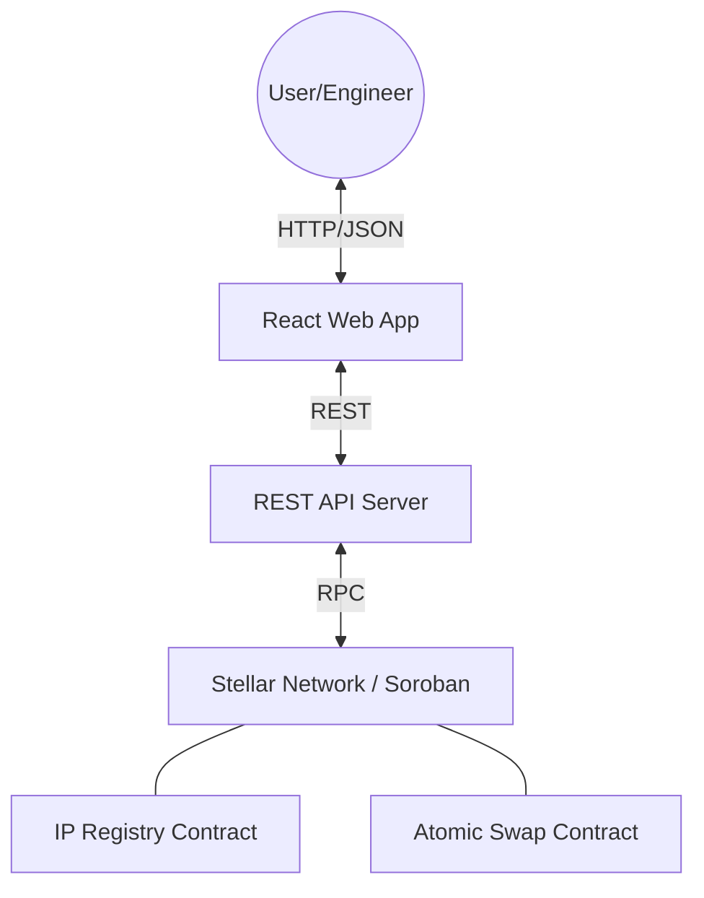
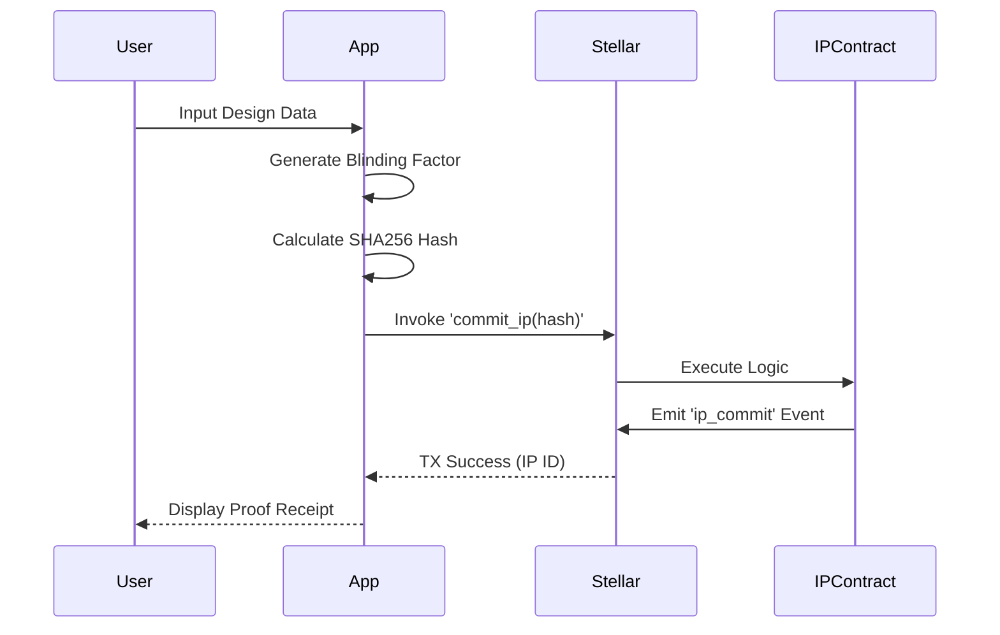
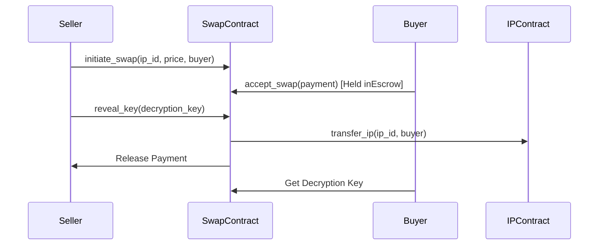

# System Architecture

Atomic Patent is a decentralized IP registry and marketplace built on the Stellar network using Soroban smart contracts.

## 🏗️ High-Level Component Diagram


```mermaid
graph TD
    User((User/Engineer))
    Frontend[React Web App]
    API[REST API Server]
    Stellar[Stellar Network / Soroban]
    IPContract[IP Registry Contract]
    SwapContract[Atomic Swap Contract]

    User <-->|HTTP/JSON| Frontend
    Frontend <-->|REST| API
    API <-->|RPC| Stellar
    Stellar --- IPContract
    Stellar --- SwapContract
```

## 🔒 Security Architecture: Pedersen Commitments

Atomic Patent uses **Pedersen Commitments** to allow users to timestamp ideas without revealing the content.

1. **Preimage:** `Secret Design Data || Blinding Factor (32 bytes)`
2. **Commitment:** `SHA256(Preimage)`
3. **Registry:** Only the `Commitment` and `Owner Address` are stored on-chain.

Proof of prior art is established by revealing the `Secret` and `Blinding Factor` later. The contract verifies that the hash matches the on-chain record.

## 🔄 Core Flows

### 1. IP Commitment Flow


```mermaid
sequenceDiagram
    participant User
    participant App
    participant Stellar
    participant IPContract

    User->>App: Input Design Data
    App->>App: Generate Blinding Factor
    App->>App: Calculate SHA256 Hash
    App->>Stellar: Invoke 'commit_ip(hash)'
    Stellar->>IPContract: Execute Logic
    IPContract->>Stellar: Emit 'ip_commit' Event
    Stellar-->>App: TX Success (IP ID)
    App-->>User: Display Proof Receipt
```

### 2. Atomic Swap Flow (Patent Sale)


```mermaid
sequenceDiagram
    participant Seller
    participant SwapContract
    participant Buyer
    participant IPContract

    Seller->>SwapContract: initiate_swap(ip_id, price, buyer)
    Buyer->>SwapContract: accept_swap(payment) [Held inEscrow]
    Seller->>SwapContract: reveal_key(decryption_key)
    SwapContract->>IPContract: transfer_ip(ip_id, buyer)
    SwapContract->>Seller: Release Payment
    Buyer->>SwapContract: Get Decryption Key
```

## 💾 Storage Model

### IP Registry Contract
- **NextId:** Monotonic counter for unique IP IDs.
- **IpRecord (u64):** Stores mapping of IP ID to metadata (owner, hash, timestamp, revocation status).
- **OwnerIps (Address):** Maps owner address to a vector of their IP IDs for efficient listing.
- **CommitmentOwner (BytesN<32>):** Reverse mapping to prevent duplicate registrations of the same hash.

### Atomic Swap Contract
- **SwapRecord (u64):** Stores details of an active/completed swap (seller, buyer, price, status, escrowed token).

## 🌍 Infrastructure

- **Network:** Stellar Testnet & Mainnet.
- **RPC:** Public Soroban RPC nodes (SDF).
- **Automation:** GitHub Actions for contract deployment and API testing.
- **Monitoring:** Periodic health checks and ledger event indexing (planned).

## 📊 Performance Benchmarks & SLA Baselines

### Benchmark Suite

Load testing is integrated as `#[cfg(test)]` benchmarks in the `IpRegistry` contract (`benchmarks.rs`).
Run with:
```bash
cargo test bench_ -p ip_registry -- --nocapture
```

### Current SLA Baselines (p99 Latency)

| Operation              | Instruction Budget | p99 Latency Target | Status |
|------------------------|-------------------|--------------------|--------|
| `commit_ip`            | ≤ 600,000         | < 300 ms           | ✓      |
| `verify_commitment`    | ≤ 600,000         | < 300 ms           | ✓      |
| `get_ip`               | ≤ 100,000         | < 50 ms            | ✓      |
| `list_ip_by_owner` (5) | ≤ 150,000         | < 75 ms            | ✓      |
| `batch_commit_ip` (10) | ≤ 2,000,000       | < 500 ms           | ✓      |
| `batch_verify` (10)    | ≤ 1,200,000       | < 500 ms           | ✓      |

*Note: Instruction budgets are measured on Soroban's deterministic CPU metering. Actual wall-clock latency depends on RPC node load and network congestion.*

### Load Testing Scenarios

The benchmark suite includes the following load scenarios:

1. **1000 concurrent `commit_ip` operations** — verifies average CPU per commit stays under the unit limit.
2. **100 concurrent `batch_commit_ip` operations** — 100 simulated users each committing 10 IPs in a single batch.
3. **1000 sustained `verify_commitment` calls** — cycles through 100 pre-committed IPs to measure verification throughput.
4. **100 batch verification requests** — each verifying 10 commitments, measuring aggregate proof overhead.
5. **SLA compliance check** — single-operation benchmarks asserting each operation stays within its instruction budget.

### Regression Alerting

Benchmarks fail the test suite if any operation exceeds its instruction budget. CI is configured to run the full benchmark suite on every PR. A failure indicates a performance regression that must be addressed before merge.
