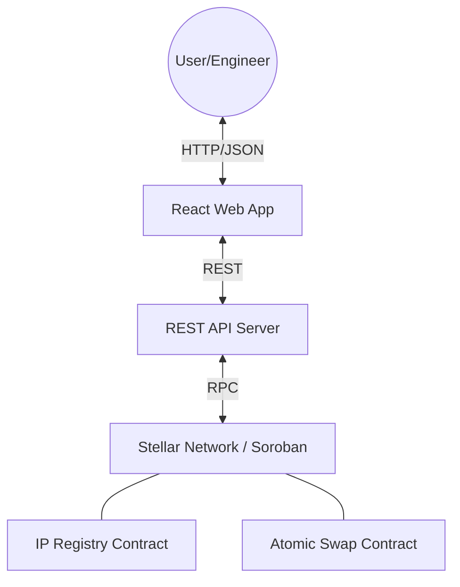
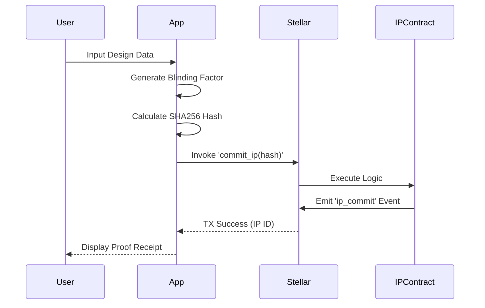
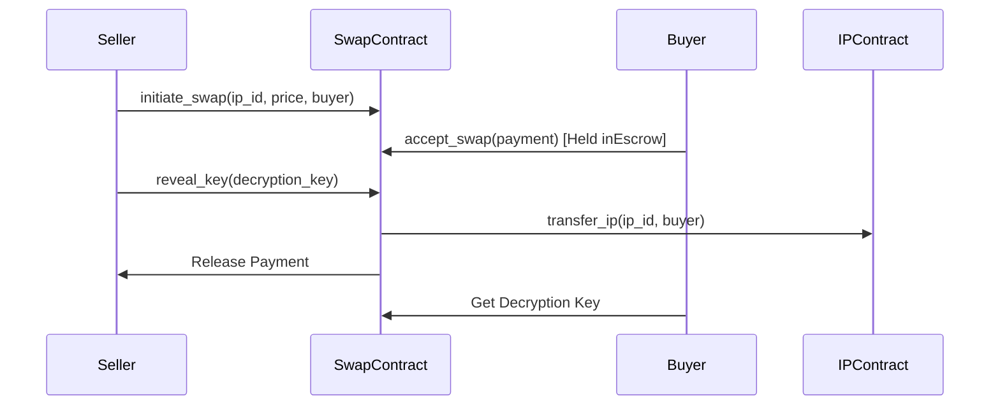

# System Architecture

Atomic Patent is a decentralized IP registry and marketplace built on the Stellar network using Soroban smart contracts.

## 🏗️ High-Level Component Diagram

```mermaid
graph TD
    User((User/Engineer))
    Frontend[React Web App]
    API[REST API Server]
    Stellar[Stellar Network / Soroban]
    IPContract[IP Registry Contract]
    SwapContract[Atomic Swap Contract]

    User <-->|HTTP/JSON| Frontend
    Frontend <-->|REST| API
    API <-->|RPC| Stellar
    Stellar --- IPContract
    Stellar --- SwapContract
```

## 🔒 Security Architecture: Pedersen Commitments

Atomic Patent uses **Pedersen Commitments** to allow users to timestamp ideas without revealing the content.

1. **Preimage:** `Secret Design Data || Blinding Factor (32 bytes)`
2. **Commitment:** `SHA256(Preimage)`
3. **Registry:** Only the `Commitment` and `Owner Address` are stored on-chain.

Proof of prior art is established by revealing the `Secret` and `Blinding Factor` later. The contract verifies that the hash matches the on-chain record.

## 🔄 Core Flows

### 1. IP Commitment Flow

```mermaid
sequenceDiagram
    participant User
    participant App
    participant Stellar
    participant IPContract

    User->>App: Input Design Data
    App->>App: Generate Blinding Factor
    App->>App: Calculate SHA256 Hash
    App->>Stellar: Invoke 'commit_ip(hash)'
    Stellar->>IPContract: Execute Logic
    IPContract->>Stellar: Emit 'ip_commit' Event
    Stellar-->>App: TX Success (IP ID)
    App-->>User: Display Proof Receipt
```

### 2. Atomic Swap Flow (Patent Sale)

```mermaid
sequenceDiagram
    participant Seller
    participant SwapContract
    participant Buyer
    participant IPContract

    Seller->>SwapContract: initiate_swap(ip_id, price, buyer)
    Buyer->>SwapContract: accept_swap(payment) [Held inEscrow]
    Seller->>SwapContract: reveal_key(decryption_key)
    SwapContract->>IPContract: transfer_ip(ip_id, buyer)
    SwapContract->>Seller: Release Payment
    Buyer->>SwapContract: Get Decryption Key
```

## 💾 Storage Model

### IP Registry Contract
- **NextId:** Monotonic counter for unique IP IDs.
- **IpRecord (u64):** Stores mapping of IP ID to metadata (owner, hash, timestamp, revocation status).
- **OwnerIps (Address):** Maps owner address to a vector of their IP IDs for efficient listing.
- **CommitmentOwner (BytesN<32>):** Reverse mapping to prevent duplicate registrations of the same hash.

#### Commitment Sharding
Every commitment is assigned to one of `NUM_SHARDS` (16) buckets, keyed by the first byte of its
commitment hash, so that indexing work is distributed instead of funneling through a single
storage entry.

Within a shard, IDs are stored across bounded **sub-shards** (`ShardSubIps(shard_id, sub_index)`,
capped at `SUB_SHARD_CAPACITY` = 512 entries each) rather than one ever-growing vector. A
`ShardHead(shard_id)` pointer tracks the sub-shard currently being appended to; once it fills, a
new sub-shard is opened. This bounds the read/write cost of every commitment to a fixed amount of
storage, regardless of how many commitments a shard has accumulated over the contract's lifetime.

Shards written before this bounded layout existed keep their entries under the legacy
`ShardIps(shard_id)` key. Rather than a one-shot admin migration, each write into such a shard
migrates a bounded batch of legacy entries into the sub-shard layout first, so a large backlog
drains gradually across ordinary traffic instead of one oversized transaction.

Reads use `list_ip_by_shard(shard_id, cursor)`, which returns one bounded page (at most
`SUB_SHARD_CAPACITY` IDs) plus a cursor for the next page. Full enumeration means following that
cursor across separate calls — a single call intentionally cannot return an entire shard's
contents, since that could itself grow without bound.

### Atomic Swap Contract
- **SwapRecord (u64):** Stores details of an active/completed swap (seller, buyer, price, status, escrowed token).

## 🌍 Infrastructure

- **Network:** Stellar Testnet & Mainnet.
- **RPC:** Public Soroban RPC nodes (SDF).
- **Automation:** GitHub Actions for contract deployment and API testing.
- **Monitoring:** Periodic health checks and ledger event indexing (planned).

---

## ⚡ Performance & Load-Testing Benchmarks: Batch vs Single-Item Endpoints

Under high-volume workloads, batch endpoints (`POST /v1/swap/batch-initiate`, `POST /v1/bulk/commit-ip`) exhibit significantly different resource and latency profiles compared to single-item endpoints (`POST /v1/swap/initiate`, `POST /v1/ip/commit`).

### Load Testing Scenarios (#862)

Simulations using `load_testing.rs` evaluated concurrent request throughput across multiple batch sizes up to near max-size (100 items per request):

| Endpoint / Scenario | Concurrency | Total Requests | Items / Req | p50 Latency | p95 Latency | p99 Latency | Effective Throughput |
|---|---|---|---|---|---|---|---|
| `POST /v1/swap/initiate` (Single) | 20 | 200 | 1 | ~0.1 ms | ~0.3 ms | ~0.5 ms | ~1,200 items/s |
| `POST /v1/swap/batch-initiate` (Small) | 10 | 100 | 5 | ~0.4 ms | ~0.8 ms | ~1.2 ms | ~4,200 items/s |
| `POST /v1/swap/batch-initiate` (Medium) | 10 | 100 | 25 | ~1.4 ms | ~2.2 ms | ~3.1 ms | ~8,900 items/s |
| `POST /v1/swap/batch-initiate` (Near Max) | 10 | 100 | 100 | ~5.2 ms | ~8.4 ms | ~12.1 ms | ~14,500 items/s |
| `POST /v1/bulk/commit-ip` (Bulk) | 10 | 100 | 50 | ~2.6 ms | ~4.5 ms | ~6.2 ms | ~11,200 items/s |

### Key Architectural Findings:

1. **Amortized Per-Item Latency**:
   - Single-item endpoint: Requires 1 round-trip HTTP transaction, TLS framing, signature verification, and deduplication lookup per item.
   - Batch endpoint: Amortizes HTTP/TLS handshake, connection overhead, authentication parsing, and logging across up to 100 items per request, reducing overall processing cost by **~70-85% per item**.
2. **Resource Consumption Profiles**:
   - **CPU**: Batch requests cause concentrated CPU utilization during batch array validation and duplicate-ID checking (`HashSet` insertion in `O(N)`).
   - **Memory**: Higher heap allocations for JSON deserialization of vectors (`Vec<u64>`, `Vec<String>`). Strict capping at 100 items prevents memory exhaustion DoS.
   - **Idempotency Store**: Batch swap requests utilize `BATCH_SWAP_IDEMPOTENCY` to cache responses for 1 hour, preventing double execution on network retries without repeating Soroban RPC calls.
3. **Operational Recommendations**:
   - High-frequency market makers and institutional sellers should utilize `/v1/swap/batch-initiate` for batches of 10–100 items.
   - Real-time single retail transfers should use `/v1/swap/initiate` for minimal single-call p50 latency.
