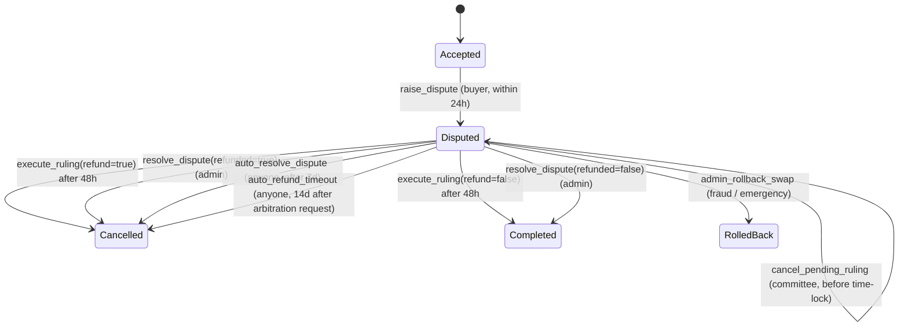
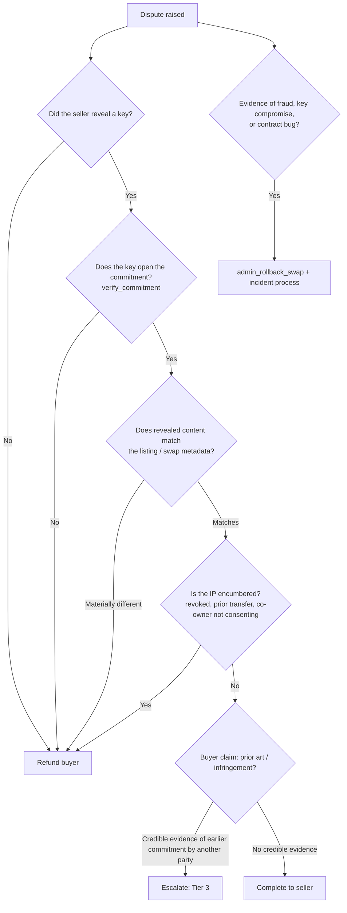

# Atomic Swap Dispute Resolution Guide

> Closes #1058. Operator guide for resolving disputes on `contracts/atomic_swap`:
> the on-chain workflow, a decision tree for common dispute types, worked examples,
> escalation procedures and arbitration guidelines.

Related: [Atomic Swap](atomic-swap.md) · [Threat Model](threat-model.md) ·
[Security](security.md) · [FAQ](FAQ.md#disputes)

---

## 1. Key Parameters

| Parameter | Default | Where |
|-----------|---------|-------|
| `dispute_window_seconds` | 86 400 s (24 h) after acceptance | `ProtocolConfig` |
| `dispute_timeout_secs` | 604 800 s (7 days) after dispute raised | `ProtocolConfig` |
| `arbitration_timeout_seconds` | 1 209 600 s (14 days) after arbitration requested | `ProtocolConfig` |
| `arbitration_ruling_delay_secs` | 172 800 s (48 h) time-lock on committee rulings | `DEFAULT_ARBITRATION_RULING_DELAY_SECONDS` |
| `MIN_COMMITTEE_SIGNERS` / `MIN_COMMITTEE_THRESHOLD` | 3 / 2 (i.e. ≥ 2-of-3) | `lib.rs` constants |
| Dispute bond | max(`MIN_DISPUTE_BOND`, 10% of price), charged on each party's first evidence submission | `charge_dispute_bond` |
| `protocol_fee_bps` | 250 (2.5%) deducted when a dispute resolves in the seller's favour | `ProtocolConfig` |

## 2. Dispute Workflow

### Step by step

1. **Raise** — The buyer calls `raise_dispute(swap_id)` while the swap is `Accepted`
   and within `dispute_window_seconds`. Emits `disputed`.
2. **Evidence** — Buyer and/or seller call `submit_dispute_evidence(swap_id, submitter,
   evidence_hash)`. Only the SHA-256 hash is stored on-chain; the evidence itself
   (screenshots, files, correspondence) is shared off-chain with the arbitrators.
   Each party's first submission escrows a dispute bond. Emits `evid_sub`, `bond_dep`.
3. **Request arbitration** (optional) — `request_arbitration` records a timestamp that
   starts the 14-day `auto_refund_timeout` clock. Emits `arb_req`.
4. **Appoint committee** — Admin calls `set_arbitrator(swap_id, admin, signers,
   threshold)`. Minimum 2-of-3, no duplicate signers, can be set once. Emits `arb_comm`.
5. **Rule** — `threshold` committee members jointly call `arbitrate_dispute(swap_id,
   signers, refund)`. Requires at least one evidence hash on file. Stores a
   `PendingRuling` snapshotting the evidence. Emits `rule_ent`.
6. **Time-lock** — For 48 h the committee can `cancel_pending_ruling` (e.g. new
   evidence, signer compromise) and re-rule. Emits `rule_can`.
7. **Execute** — After the delay anyone calls `execute_ruling(swap_id)`. Funds move,
   bonds settle (winner refunded, loser forfeited). Emits `disp_res`.

### Fallback paths

| Path | Who | When | Outcome |
|------|-----|------|---------|
| `resolve_dispute` | Admin | Any time while `Disputed` | Direct resolution; bypasses committee/time-lock; bonds refunded uncontested |
| `auto_resolve_dispute` | Anyone | ≥ 7 days after dispute raised | Buyer refunded (`dispute_timeout`) |
| `auto_refund_timeout` | Anyone | ≥ 14 days after `request_arbitration` | Buyer refunded |
| `admin_rollback_swap` | Admin | Fraud / contract emergency, not `Completed` | Swap `RolledBack`, parties refunded |

> **Operator note:** timeouts default to refunding the buyer. Inaction therefore
> favours the buyer — sellers should submit evidence early.

## 3. Decision Tree

### Dispute type reference

| Type | Typical evidence | Default outcome |
|------|------------------|-----------------|
| **Non-delivery** — key never revealed | Swap history (`get_swap_history`), no `revealed` event | Refund buyer |
| **Invalid key** — key doesn't open commitment | Failed `verify_commitment` result | Refund buyer |
| **Misrepresentation** — content differs from description | Listing text vs. revealed content hash | Refund buyer if material; otherwise seller |
| **Quality / buyer's remorse** — content matches but buyer unhappy | Buyer statement only | Complete to seller |
| **Title defect** — IP revoked, transferred, or disputed co-ownership | `get_ip`, registry events | Refund buyer |
| **Prior-art challenge** — another party committed first | Earlier on-chain commitment + opening | Escalate (Tier 3) |
| **Fraud / compromise** — stolen keys, sybil accounts, exploit | Security logs, audit logs | Rollback + incident |

## 4. Examples of Fair Resolutions

**Example 1 — Invalid key.** Buyer disputes 2 h after acceptance; evidence shows
`verify_commitment` returns `false` for the revealed key. Seller submits no evidence.
→ Committee rules `refund=true`. Buyer receives the price and bond back; seller has no
bond at stake. *Rationale:* the core guarantee of the swap failed.

**Example 2 — Buyer's remorse.** Key opens the commitment and the content matches the
listing exactly; buyer says "not as useful as expected".
→ `refund=false`. Seller receives price minus 2.5% fee and their bond back; buyer's
bond is forfeited. *Rationale:* the seller delivered what was committed and described.

**Example 3 — Partial misrepresentation.** Listing promised "CAD files + BOM"; only CAD
was delivered. The BOM was a material part of the listing.
→ `refund=true`. *Rationale:* the contract cannot split funds on a ruling; when the
missing part is material, refund and let parties relist a correct swap. If it is
immaterial, rule for the seller.

**Example 4 — Silent seller.** Buyer disputes and requests arbitration; seller never
responds. No committee is appointed within 7 days.
→ Anyone calls `auto_resolve_dispute`; buyer refunded. *Rationale:* protocol default.

**Example 5 — Prior-art challenge.** Buyer shows a third party committed a matching
hash 6 months before the seller and can open it.
→ Escalate to Tier 3; if confirmed, `refund=true` and flag the seller's IP for review.

## 5. Escalation Procedures

| Tier | Handler | Triggers | Target response |
|------|---------|----------|-----------------|
| **Tier 1 — Self-service** | Parties | Any dispute | Parties exchange evidence; buyer may simply wait for timeouts |
| **Tier 2 — Committee** | 2-of-3 (or larger) arbitrator committee | Evidence submitted by at least one party | Ruling within 72 h of committee appointment |
| **Tier 3 — Senior review** | Expanded committee (e.g. 3-of-5) incl. domain expert | Prior-art/IP ownership questions, value above operator threshold, committee deadlock, appeal of a pending ruling | Decision within 7 days |
| **Tier 4 — Emergency** | Admin + security team | Fraud, key compromise, contract bug | Immediate; `pause` / `admin_rollback_swap`, follow [SECURITY.md](../SECURITY.md) |

### Escalation rules

1. **Appeals** are only possible during the 48 h time-lock: the committee cancels the
   pending ruling (`cancel_pending_ruling`) and re-rules after Tier 3 review.
   Once `execute_ruling` runs, the result is final on-chain.
2. **Deadlock** (threshold not reached within 72 h) → escalate to Tier 3.
   Remember the 7-day `auto_resolve_dispute` clock keeps running.
3. **Conflict of interest** — a committee member related to either party must recuse;
   the admin appoints committees once per swap, so choose members carefully.
4. **Every escalation** is recorded in the operator log with swap ID, tier, reason,
   and the evidence hashes considered.

## 6. Arbitration Guidelines

### Principles
- **Evidence-based** — rule only on evidence whose hash is on-chain
  (`get_dispute_evidence`). The `PendingRuling` snapshots these hashes; reference
  them in the written rationale.
- **On-chain facts first** — commitments, timestamps and events outrank off-chain claims.
- **Neutrality** — the protocol's default (refund on timeout) is not a presumption
  for committee rulings.
- **Consistency** — follow the decision tree; document any deviation.
- **Proportionality** — refund when the core promise (valid key, matching content,
  clean title) failed; otherwise complete to the seller.

### Committee composition
- At least 3 signers, threshold ≥ 2 (enforced on-chain).
- Signers should be independent keys held by different people/organisations.
- For high-value swaps use 3-of-5 or larger.

### Operational checklist for a ruling
- [ ] Swap status is `Disputed` (`get_swap`)
- [ ] Evidence hashes retrieved and off-chain files verified against them
- [ ] `verify_commitment` checked for the revealed key (if any)
- [ ] Decision tree applied; dispute type recorded
- [ ] Written rationale stored off-chain and its hash recorded
- [ ] Threshold signers co-sign `arbitrate_dispute`
- [ ] Time-lock monitored for 48 h for new evidence / appeals
- [ ] `execute_ruling` called after the delay; `disp_res` event confirmed
- [ ] Bond settlement events (`bond_rfd` / forfeit) confirmed

### Monitoring
Subscribe to these contract events to drive operator alerts:
`disputed`, `evid_sub`, `bond_dep`, `arb_req`, `arb_comm`, `rule_ent`, `rule_can`,
`disp_res`. Alert when a dispute has no committee after 48 h, or is within 24 h of
`auto_resolve_dispute` eligibility.
