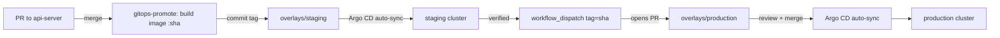

# GitOps Deployment Pipeline

> Issue #1069. Owner: Platform. Tooling: [Argo CD](https://argo-cd.readthedocs.io/) + Kustomize.

Deployments are declarative: the desired state of every environment lives in
Git under `deploy/`, and Argo CD continuously reconciles the cluster to it.
Nobody runs `kubectl apply` against production.

## Layout

```
deploy/
├── argocd/
│   ├── project.yaml          # AppProject: allowed repos, namespaces, kinds, sync windows
│   └── applications.yaml     # atomicip-staging, atomicip-production Applications
└── k8s/
    ├── base/                 # Deployment, Service, HPA (#1067), PDB
    ├── jobs/                 # CronJobs: backup verification (#1066), cost optimization (#1067)
    └── overlays/
        ├── staging/          # namespace atomicip-staging, testnet, 1–3 replicas
        └── production/       # namespace atomicip-production, mainnet, 3–20 replicas
```

## Bootstrap (once per cluster)

```bash
kubectl create namespace argocd
kubectl apply -n argocd -f https://raw.githubusercontent.com/argoproj/argo-cd/v2.12.3/manifests/install.yaml
kubectl apply -n argocd -f deploy/argocd/
```

`deploy/argocd/argocd-cm.yaml` sets `kustomize.buildOptions: --load-restrictor LoadRestrictionsNone`
so the jobs kustomization can package `scripts/ops/*.sh` into a ConfigMap.

Create the out-of-band secrets (never committed): `atomicip-api-secrets`
(`DATABASE_URL`, `JWT_SECRET`, `PAGERDUTY_ROUTING_KEY`, …) and `atomicip-backup`
in each namespace, ideally via External Secrets / Sealed Secrets.

## How a change reaches production



1. **Merge to `main`** (touching `api-server/`) → `.github/workflows/gitops-promote.yml`
   builds `ghcr.io/atomicip/api-server:<sha>` and commits the new tag to
   `deploy/k8s/overlays/staging`. Argo CD syncs staging automatically.
2. **Promote**: run *GitOps Promote* with `tag=<sha>`. The workflow verifies the
   image exists and opens a pull request bumping the production overlay.
3. **Review**: `.github/workflows/gitops-validate.yml` renders both overlays,
   validates them with kubeconform and posts the rendered diff on the PR.
   Production changes need an approving review (protect `deploy/k8s/overlays/production/`
   with CODEOWNERS + branch protection).
4. **Merge = deploy.** Argo CD (automated sync, `prune`, `selfHeal`) applies the
   change. The `AppProject` sync window only allows automatic production syncs
   Mon–Fri 08:00–18:00 UTC; on-call can sync manually outside it.

Config changes (ConfigMap literals, HPA bounds, resource requests) follow the
same path: edit the overlay in a PR, merge, done.

## Rollback

Rollback is `git revert` of the promotion commit — Git history *is* the deploy log.

```bash
scripts/gitops-rollback.sh production            # revert newest production promotion
scripts/gitops-rollback.sh production <sha>      # revert a specific commit
scripts/gitops-rollback.sh staging               # staging: pushed directly to main
```

For production the script opens a revert PR; merge it (an expedited review is
fine during an incident) and Argo CD syncs the previous image. Emergency only:
`argocd app rollback atomicip-production <history-id>` restores the cluster
immediately, but **must be followed by the revert PR**, otherwise `selfHeal`
re-applies the bad revision on the next sync.

Contract (Soroban) upgrades are *not* GitOps-managed; see
[contract-upgrades.md](contract-upgrades.md).

## Drift and observability

* `selfHeal: true` reverts manual edits in the cluster. Use `argocd app diff` to see drift.
* `ignoreDifferences` on `/spec/replicas` lets the HPA own replica counts.
* Argo CD notifications page on `sync-failed` / `health-degraded` for production
  (incident pipeline, #1068) and post successful deploys to Slack.
* Prometheus alerts `ArgoAppOutOfSync` and `ArgoAppDegraded` live in
  `monitoring/prometheus/operations-rules.yml`.

## Troubleshooting

| Symptom | Check |
|---------|-------|
| App `OutOfSync` for > 30 min | `argocd app get atomicip-production` — sync window closed? manifest error? |
| Sync fails with "resource not permitted" | Kind missing from `namespaceResourceWhitelist` in `project.yaml` |
| Promotion PR not created | Image tag missing in GHCR; check the `build-and-stage` run for that SHA |
| App `Degraded` after sync | Readiness probe failing — roll back first, investigate second |
