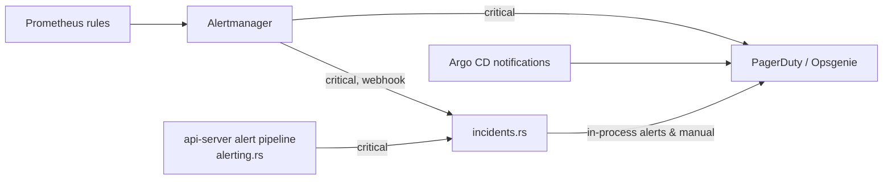

# Incident Response Procedures

> Issue #1068. Owner: Platform on-call. Complements
> [disaster-recovery.md](disaster-recovery.md) (recovery steps) and
> [alerting-best-practices.md](alerting-best-practices.md) (alert design).

## 1. Integration overview



* **Automatic creation.** Every critical alert opens an incident:
  in-process alerts from `api-server/src/alerting.rs` via the background
  evaluator, and Prometheus alerts via the Alertmanager `incident-tracker`
  webhook (`POST /v1/admin/incidents/alertmanager`). Re-fires of the same alert
  are deduplicated onto the open incident (`trigger_count` + timeline entry);
  when the alert resolves, the incident resolves.
* **Paging.** Set `INCIDENT_PROVIDER=pagerduty` (+ `PAGERDUTY_ROUTING_KEY`) or
  `INCIDENT_PROVIDER=opsgenie` (+ `OPSGENIE_API_KEY`, optional `OPSGENIE_API_URL`).
  Incidents from in-process alerts and manual declarations are sent to the
  provider (PagerDuty Events API v2 / Opsgenie Alerts API). Alertmanager-sourced
  incidents are tracked but *not* re-sent, because Alertmanager pages the
  provider directly (`pagerduty-oncall` / `opsgenie-oncall` receivers).
* **Acknowledgment** in the API stops in-process escalation
  (`ALERT_MANAGER.acknowledge`) and acknowledges at the provider. Acknowledging
  in PagerDuty/Opsgenie directly is also fine; record it with the API so MTTA is tracked.

### API

| Method & path | Purpose |
|---------------|---------|
| `GET  /v1/admin/incidents?status=` | List incidents (newest first) |
| `POST /v1/admin/incidents` | Declare manually: `{title, severity: "sev1"\|"sev2"\|"sev3", reporter, description?}` |
| `GET  /v1/admin/incidents/{id}` | Incident with full timeline |
| `POST /v1/admin/incidents/{id}/acknowledge` | `{actor}` |
| `POST /v1/admin/incidents/{id}/notes` | `{actor, message}` – timeline entry |
| `POST /v1/admin/incidents/{id}/resolve` | `{actor, note?}` |
| `POST /v1/admin/incidents/{id}/postmortem` | Attach postmortem (resolved incidents only) |
| `GET  /v1/admin/incidents/stats` | Open counts, MTTA, MTTR, overdue postmortems |

Metrics: `incidents_created_total{severity}`, `incidents_retriggered_total`,
`incident_time_to_acknowledge_seconds`, `incident_time_to_resolve_seconds`,
`incident_provider_requests_total{provider,outcome}`, `incident_postmortems_total`.

## 2. Severity levels

| Severity | Definition | Examples | Ack target | Update cadence |
|----------|-----------|----------|-----------|----------------|
| **SEV1** | Funds or IP integrity at risk, or full outage | Escrow stuck, key compromise, API down for all users | 5 min | 30 min |
| **SEV2** | Major degradation, no data/funds at risk | Soroban RPC outage, write endpoints failing, backup verification failed | 15 min | 1 h |
| **SEV3** | Minor/partial degradation | Elevated latency, single non-critical job failing | 4 h (business hours) | Daily |

Mapping: critical alert → SEV2; critical alert at escalation level ≥ 2 or
labelled `severity="sev1"` → SEV1; everything else → SEV3. Anyone may raise severity.

## 3. Roles

* **Incident Commander (IC)** – the first responder until handed over. Owns decisions, not keyboards.
* **Operations lead** – executes mitigation (rollback, failover, scaling).
* **Communications lead** – status page and stakeholder updates (SEV1/SEV2).
* **Scribe** – keeps the timeline (`/notes`) current.

For SEV3 one person holds all roles.

## 4. Response procedure

1. **Acknowledge** within the target (PagerDuty/Opsgenie app or `POST …/acknowledge`).
2. **Assess**: confirm impact via Grafana, `/health/detailed`, `/v1/admin/alerts`.
   Adjust severity if needed. Declare in `#atomicip-incidents`.
3. **Mitigate first, diagnose second.** Preferred mitigations, in order:
   * Bad deploy → `scripts/gitops-rollback.sh production` ([gitops.md](gitops.md#rollback)).
   * RPC outage → fail over provider ([disaster-recovery.md](disaster-recovery.md)).
   * Load → confirm HPA is scaling; raise `maxReplicas` via overlay PR.
   * Contract emergency → pause/freeze per [contract-upgrades.md](contract-upgrades.md).
4. **Communicate** on the cadence above. Every significant action goes into the timeline.
5. **Resolve** once impact has ended and monitoring is green for 15 min
   (`POST …/resolve` with a one-line note). Alert-sourced incidents resolve automatically when the alert clears — verify, don't assume.
6. **Follow up**: SEV1/SEV2 require a postmortem (§6).

## 5. Escalation

If the primary does not acknowledge within the target, the provider escalation
policy pages the secondary, then the engineering manager. Escalate immediately to
security (`SECURITY.md`) for any suspected key compromise or exploit.

## 6. Postmortems

* Required for every SEV1/SEV2; due within **5 business days** of resolution.
  `GET /v1/admin/incidents/stats` lists `postmortems_due`.
* Blameless: focus on systems and processes, not individuals.
* Write it with [postmortem-template.md](postmortem-template.md), review in the
  weekly ops meeting, then attach it:

```bash
curl -X POST "$API/v1/admin/incidents/INC-1A2B3C4D5E/postmortem" -H 'Content-Type: application/json' -d '{
  "author": "oncall-primary",
  "summary": "Write endpoints returned 503 for 42 minutes",
  "impact": "~1,200 failed commit requests; no funds or IP state affected",
  "root_cause": "RPC provider rate-limited our key after a config change",
  "contributing_factors": ["No alert on RPC 429 rate"],
  "what_went_well": ["Rollback via git revert took 4 minutes"],
  "what_went_wrong": ["Failover runbook referenced an old endpoint"],
  "action_items": [{"description": "Alert on RPC 429s", "owner": "platform", "tracking_url": "https://github.com/AtomicIP/AtomicIP-/issues/NNN"}],
  "document_url": "https://…/postmortems/2026-09-27-rpc-rate-limit.md"
}'
```

* Every action item gets a GitHub issue with the `postmortem` label.

## 7. Drills

Quarterly game day: fire a synthetic critical alert through Alertmanager
(`amtool alert add IncidentDrill severity=critical`), and run the procedure end
to end including a postmortem. Track MTTA/MTTR trends from `/v1/admin/incidents/stats`.
